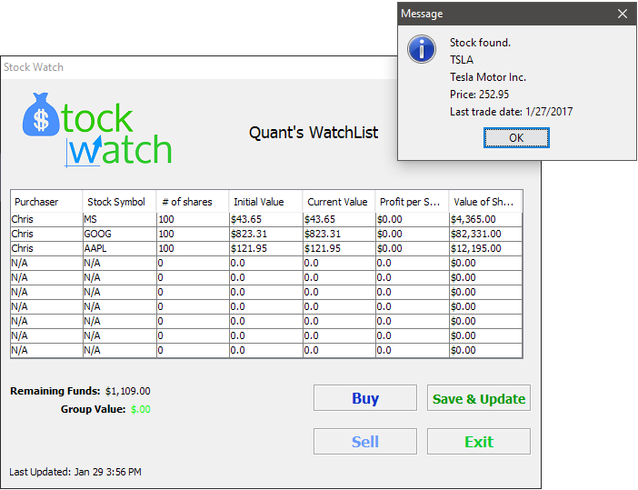

# stock-watch

Simple Java app that allows students to build a live portfolio of real stocks with fake money (and save it locally to an account)
Created as a senior in high school for final project in an Object-Oriented Programming course with [Stanley Hu](https://www.linkedin.com/in/stanley-hu-39790173) and Alan Cai.
Designed to be used by a teacher to allow students to simulate creating a stock portfolio.

## Features:
- basic account/login system with groups/admin control functionality
- live retreival of stock data from Yahoo Finance
- Documentation for admin/students
- Lots of bugs associated with .csv File I/O
